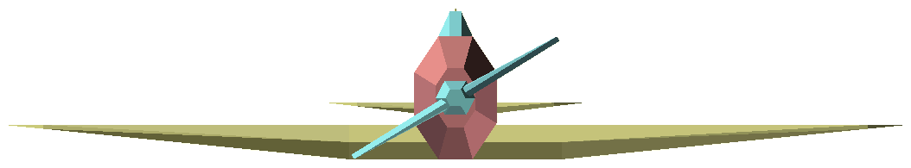
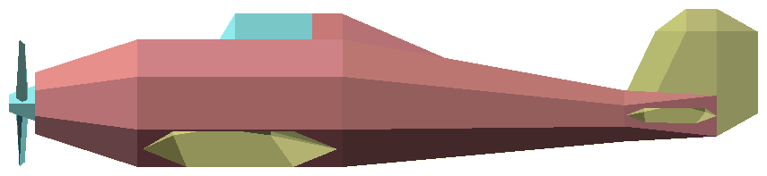
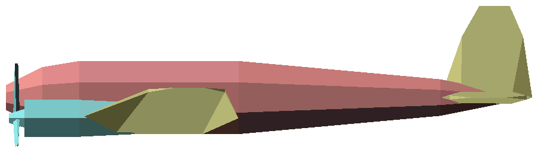
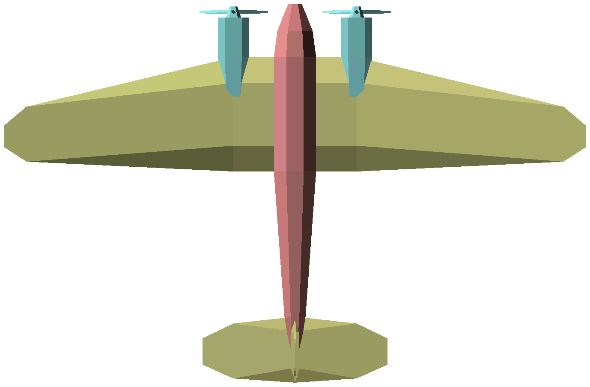
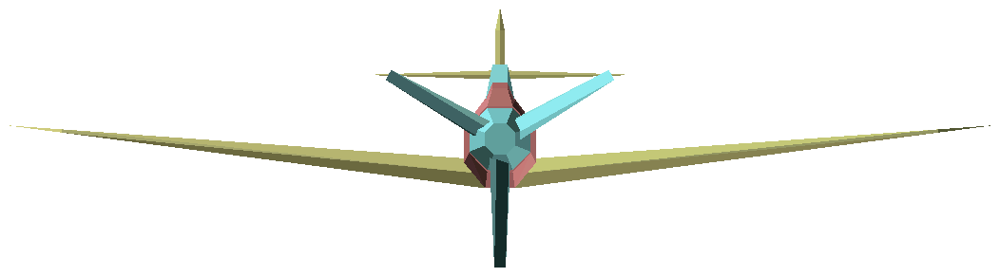
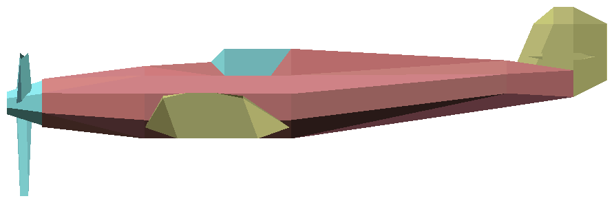
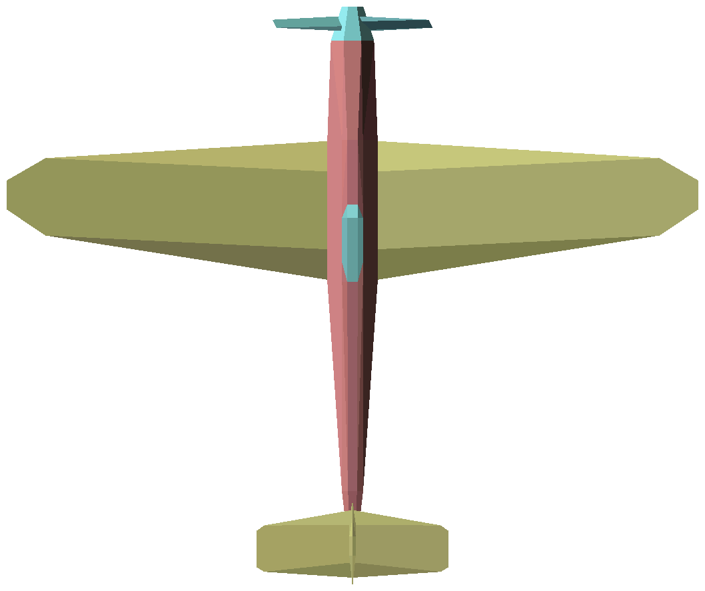
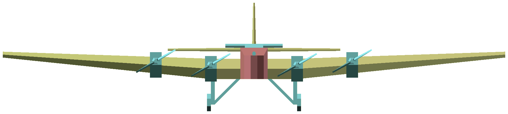
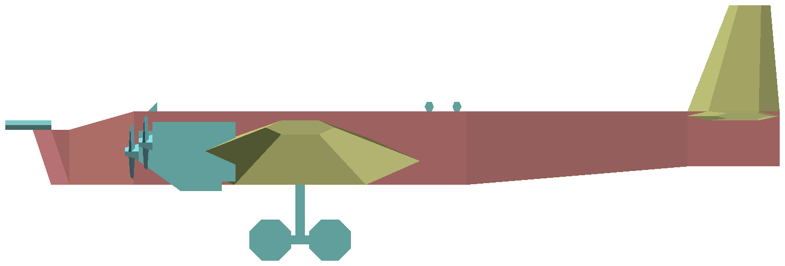

# openscad-models
My OpenSCAD creations. The file `common.scad` contains primitives used by all the other `.scad` files. The screenshots below may be out of date.

Table of contents:
* [Hawker Hurricane](#hawker-hurricane)
* [Heinkel He 111](#heinkel-he-111)
* [Messerschmitt Bf 109](#messerschmitt-bf-109)
* [Tupolev TB-3](#tupolev-tb-3)

## Hawker Hurricane
File: `hawker-hurricane.scad`. A British fighter. [Schematics](https://commons.wikimedia.org/wiki/File:Hawker_Hurricane_3-view.svg) (Wikimedia Commons)

## Heinkel He 111
File: `heinkel-he111.scad`. A German medium bomber. [Schematics](https://commons.wikimedia.org/wiki/File:Heinkel_He_111_H-1_3-view_line_drawing.svg) (Wikimedia Commons)

## Messerschmitt Bf 109
File: `messerschmitt-bf109.scad`. A German fighter. [Schematics](https://commons.wikimedia.org/wiki/File:Messerschmitt_Bf_109_G-5_3-seiten_neu.jpg) (Wikimedia Commons)

## Tupolev TB-3
File: `tupolev-tb3.scad`. A Soviet heavy bomber. [Schematics](https://commons.wikimedia.org/wiki/File:Tupoljev_TB-3.svg) (Wikimedia Commons)

